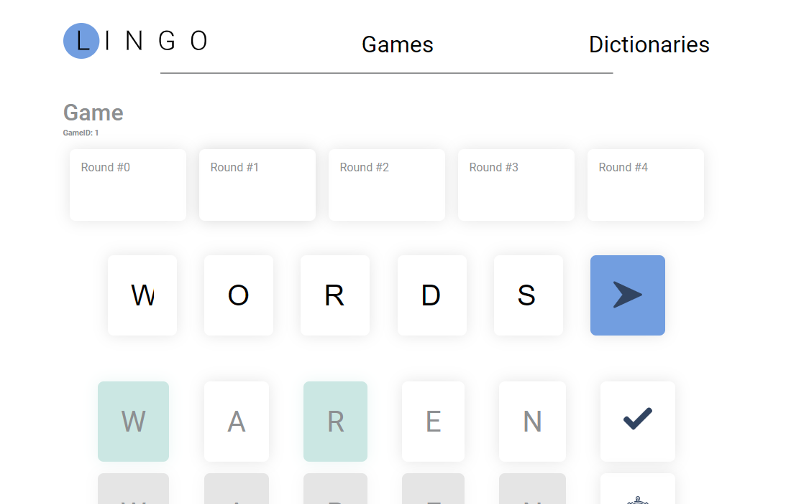

Lingo is a word guessing game powered by Spring boot and Vue.

## 🚀  Setup

1. Follow the setup instructions on [the lingo repo](https://github.com/joostlek/lingo).
2. Clone this repo with `git clone https://github.com/joostlek/lingo-web`.
3. Run `yarn` to download all dependencies.
4. Run `yarn serve` to start the application. 

The project can also be run through Docker. The github package repository stores the image. You can find it [here](https://github.com/joostlek/lingo-web/packages/267853).

## 🖼 Screenshot

